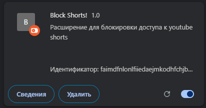

# 🚫 Block Shorts! — Браузерное расширение против YouTube Shorts
### (Проект находится в состоянии разработки)
Легковесное расширение для браузеров на базе Chromium , которое полностью блокирует переходы на YouTube Shorts. 

Весь проект собран на базе актуального стандарта **Manifest V3** и содержит всего 7 строк чистого функционального кода, который бьёт точно в цель.


##  Код проекта
Проект состоит из манифеста настроек (`manifest.json`) и одного скрипта, который выглядит максимально лаконично:

```javascript
function home() {
    if (window.location.href.includes('/shorts/')) {
        window.location.href = 'https://youtube.com'
    }
}

window.addEventListener('yt-navigate-start', home)
```

---

##  Как установить локально

1. Скачай файлы репозитория в одну папку на компьютере.
2. Открой браузер и перейди по ссылке `chrome://extensions/` (или `browser://extensions/` в Яндекс.Браузере).
3. В правом верхнем углу включи тумблер **«Режим разработчика»**.
4. В левом верхнем углу нажмите кнопку **«Загрузить распакованное расширение»**.
5. Выберите папку с файлами проекта. 
6. Открывай YouTube — защита уже работает в фоне автоматически!
7. Чтобы отключить расширение нажмите на расширения,управление расширениями и нажмите на переключатель. 
---

*Developed by [gtxpit](https://github.com/gtxpit) — 2026*


